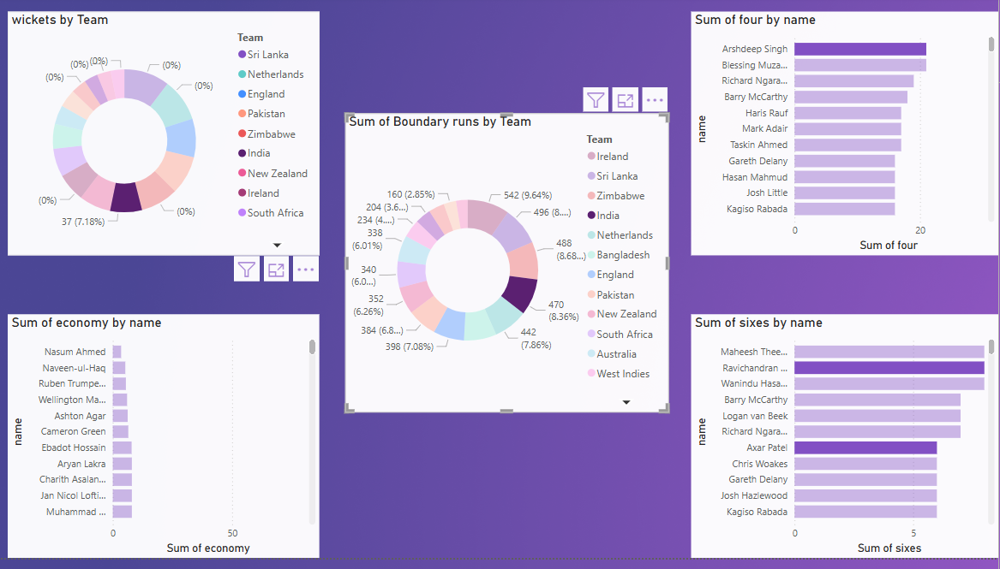
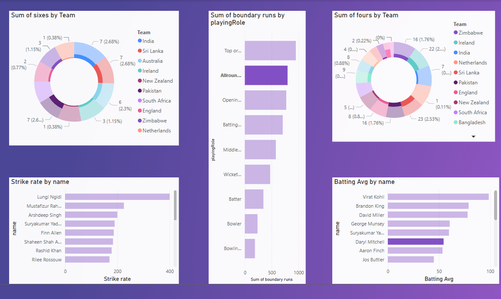

# 🏏 Cricket Analytics Dashboard

This repository provides a comprehensive visualization dashboard analyzing team and player performances in cricket. The project features key metrics like wickets, boundary runs, strike rates, and more, aimed at uncovering performance patterns and player strengths.

---

## 📊 Dashboard Overview

### 🔹 Key Insights from Visualizations

#### 📌 Part 1: Bowling and Boundary Insights



- **Wickets by Team**: Highlights bowling strength across teams.
- **Boundary Runs by Team**: Total boundary contributions per team.
- **Economy by Player**: Lists bowlers with the best economy.
- **Sixes by Player**: Top six hitters.
- **Fours by Player**: Players with the most fours.

---

#### 📌 Part 2: Batting Insights and Role-wise Performance



- **Sixes and Fours by Team**: Measures team aggressiveness.
- **Boundary Runs by Playing Role**: Shows contribution by batting order or role.
- **Strike Rate by Player**: Quickest scorers in the dataset.
- **Batting Average by Player**: Most consistent batters.

---

## 📁 Repository Structure

``` bash
📦 cricket-analytics-dashboard/
│
├── data/ # Raw and processed data files
├── notebooks/ # Analysis and visualization notebooks/scripts
├── images/ # Exported visualizations
│ ├── data_visualize.jpg
│ └── data_visualize_2.jpg
├── README.md # Project documentation
```

---

## 🛠️ Technologies Used

- **Python**
- **Pandas**, **NumPy** – Data manipulation
- **Jupyter Notebook** – Data analysis
- **Power BI**- interactive dashboards

---

## 🚀 Getting Started

1. **Clone the repository**:
   ```bash
   git clone https://github.com/yourusername/cricket-analytics-dashboard.git
   cd cricket-analytics-dashboard
  

